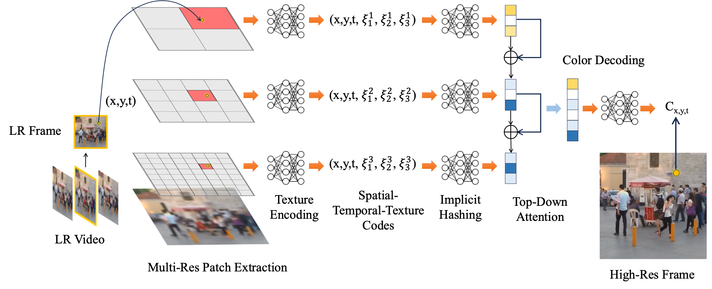
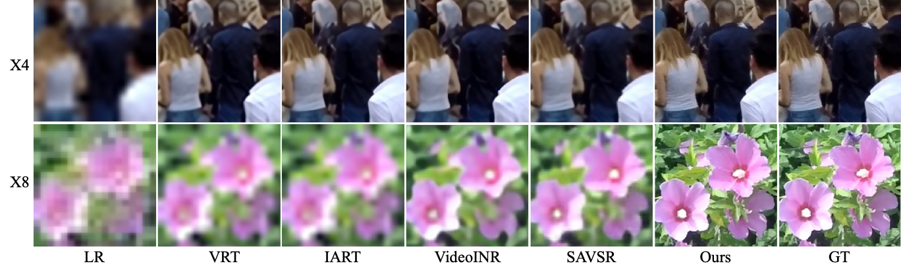

<!-- ✅ MathJax injection for LaTeX rendering -->

<!-- <h1 style="display: block;">Unsupervised Microscopy Video Denoising</h1> -->
<table style="border: none; display: initial;">
<tr style="border: none;">
<td style="border: none;"><a href="https://maryaiyetigbo.github.io/">Mary Damilola Aiyetigbo</a>1</td>
<td style="border: none;"><a href="wanqiy@clemson.edu">Wanqi Yuan</a>1</td>
<td style="border: none;"><a href="luofeng@clemson.edu">Feng Luo</a>1</td>
<td style="border: none;"><a href="nianyil@clemson.edu">Nianyi Li</a>1</td>
</tr>
</table>
 
<table style="border: none; display: initial;">
<tr style="border: none;">
<td style="border: none;">1Clemson University</td>
<!-- <td style="border: none;">2MUSC</td> -->
</tr>
</table>

 

<table style="border: none; display: initial;">
<tr style="border: none;">
<td style="border: none;">
<a href="#" style="color: #ffffff">

<i class="bi bi-file-earmark-richtext"></i> Paper

</a>
</td>
<td style="border: none; display: initial;">
<a href="https://github.com/maryaiyetigbo/VRINR" style="color: #ffffff">

<i class="bi bi-github"></i> Code

</a>
</td>
</tr>
</table>

<!-- ## Two Photon Calcium Imaging
  -->

# Abstract

High-resolution (HR) videos play a crucial role in many computer vision applications.  Although existing video restoration (VR) methods can significantly enhance video quality by exploiting temporal information across video frames, they are typically trained for fixed upscalling factors and lack the flexibility to handle scales or degradations beyond their training distribution. In this paper, we introduce VR-INR, a novel video restoration approach based on Implicit Neural Representations (INRs) that is trained only on a single upscalling factor ($\times 4$) but generalizes effectively to arbitrary, unseen super-resolution scales at the test time. Notably, VR-INR also performs zero-shot denoising on noisy input, despite never having seen noisy data during training. Our methods employs a hierarchical spatial-temporal-texture encoding framework coupled with multi-resolution implicit hash encoding, enabling adaptive decoding of hight-resolution and noise-suppressed frames from low-resolution inputs at any desired magnification. Experimental results show that VR‑INR consistently maintains high-quality reconstructions at unseen scales and noise during training, significantly outperforming state‑of‑the‑art approaches in sharpness, detail preservation, and denoising efficacy.

## Architecture

We propose **VR-INR**, a novel video restoration approach based on Implicit Neural Representations. VR-INR is trained only on clean data for super-resolution but generalizes effectively to arbitrary, unseen super-resolution scales at test time. Given an input sequence of low-resolution (LR) video: 
$$
\{\mathbf{I}^{\text{LR}}_{t}|t = 1, 2, \ldots, T\}
$$ 
(where $$T$$ is the total number of frames, and 
$$
\mathbf{I}^{\text{LR}}_{t}
$$
 represents a LR frame in the video) and a high-resolution grid $$\mathbf{r}^{\text{HR}}\in\mathbb{R}^2$$ specifying the spatial coordinates, VR-INR aims to produce high-resolution (HR) videos $$\{\mathbf{I}^{\text{HR}}_{t}|t = 1, 2, \ldots, T\}$$. 

Our method enhances video denoising by integrating two main components: a feature generator $\mathcal{G}_\phi$ and a Denoiser $\mathcal{D}\theta$. This approach diverges from traditional methods by applying a temporal filter to feature maps generated by CNN layers, before denoising, rather than directly interpolating frames. This process involves selecting a subset of frames from a noisy video, processing these through the feature generator to produce feature maps, and then weighting these feature maps based on their temporal proximity to the central frame using a temporal filter. The temporal filter $\{ \gamma_t\}_{t=1}^N$ weights these feature maps $\{\mathbf{F}_t\}_{t=1}^N$ by assigning diminished values to features nearer the central frame compared to those more distant. The weighted feature maps are then concatenated and processed by the Denoiser to produce the final denoised frame. This technique is particularly effective for videos with high frame rates and slow-moving objects, showcasing a significant improvement in denoising capabilities.

We propose VR-INR, a novel video restoration approach based on Implicit Neural Representations. VR-INR is trained only on clean data for super-resolution but generalizes effectively to arbitrary, unseen super-resolution scales at test time. Given an input sequence of low-resolution (LR) video: $\{\mathbf{I}^{\text{LR}}_{t}|t = 1, 2, \ldots, T\}$ (where $T$ is the total number of frames, and $\mathbf{I}^{\text{LR}}_{t}$ represents a LR frame in the video) and a high-resolution grid $\mathbf{r}^{\text{HR}}\in\mathbb{R}^2$ specifying the spatial coordinates, VR-INR aims to produce high-resolution (HR) videos $\{\mathbf{I}^{\text{HR}}_{t}|t = 1, 2, \ldots, T\}$. First, we employ hierarchical texture encoding network to extract and encode multi-scale local patches into spatial-temporal-texture feature representations $\mathbf{F}_{\text{STT}}$. For each target high-resolution coordinate $\mathbf{r}^{\text{HR}}$ at frame $t$, we retrieve a compact set of neighboring feature vectors from a spatial hash table using implicit hashing, and efficiently interpolate these vectors using adaptively learned weights to generate robust implicit features $\mathbf{v}^l$. We then integrate these multi-resolution features $\{\mathbf{v}^l\}_{l=1}^L$ through a top-down attention mechanism, which sequentially refines and combines feature representations from coarse to fine resolutions. Finally, we decode the consolidated feature representations $\mathbf{v}^{\text{HR}}$ into RGB values using a multi-layer perceptron (MLP), generating the final HR video frames $\mathbf{I}^{\text{HR}}_{t}$.

## Results
<!-- Two Photon Calcium Imaging | Fluorescence Microscopy
:-------------------------:|:-------------------------:
 | 

 Two Photon Calcium Imaging           |  Fluorescence Microscopy
:-------------------------:|:-------------------------:
  |   -->

## Video SuperResolution
 

<table>
 <tr>
  <th align="center"> Two Photon Calcium Imaging </th>
  <th align="center"> Fluorescence Microscopy </th>
 </tr>
 <tr>
  <td align="center">  </td>
  <td align="center">  </td>
 </tr>
</table>

## Results on Natural Videos
<table style="border: none;">
 <tr style="border: none;"><th align="left" style="border: none;"> Bobblehead </th></tr>
 <tr style="border: none;"><td align="left" style="border: none;">  </td></tr>
 <tr style="border: none;"><th align="left" style="border: none;"> Runner </th></tr>
 <tr style="border: none;"><td align="left" style="border: none;">  </td></tr>
</table>

 <!-- Bobblehead           |  Runner
:-------------------------:|:-------------------------:
  |   --> -->

<!-- ###
 -->

<!-- **Performance in Denoising Synthetic Noise.** This table presents a comparison of average PSNR/SSIM values of denoised performance on LIVE-YT-HFR datasets on different noise types and intensities. Our method demonstrates superior performance in most cases and remains highly competitive with the supervised methods.